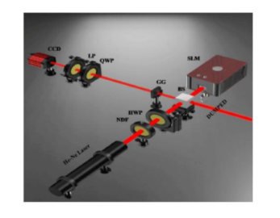
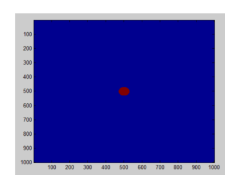
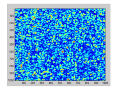
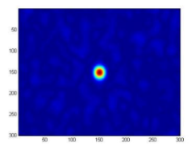
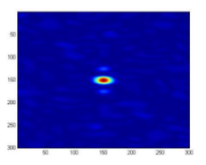
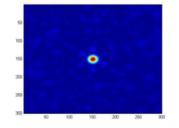

# BTP
Matlab code for BTP
This repository contains the Matlab code for my BTP titled 'Simulations of Spherical and Helical Beam with MATLAB'. In order to obtain the plots and distributions shown in the report follow the code.
The experimental setup used in the BTP is as follows;

He-Ne laser light beam is attenuated with a neutral density filter and oriented at 45 degrees with respect to the horizontal direction using a half-wave plate. The beam splitter divides the 45-degree polarised beam into two equal-intensity beams (BS). The structure of the vortex beam is shown on a phase-only SLM with a resolution of 1920 × 1080 and a pixel pitch of 8um that is illuminated by a beam transmitted from the BS. As a result, the vortex information’s structure is fed into the x-polarization component of the beam, but the y-polarization component stays unchanged, i.e., there is no vortex. The beam from the SLM reflects off the BS and goes into the ground glass, where random scattering distorts the incident light and produces a speckle pattern. Employment of optical elements to measure the SPS to identify the polarisation states of randomly scattered light. The random light is then filtered by a linear polarizer after passing through a quarter wave plate (QWP) that is rotated at an angle with respect to the x direction. The LP’s transmission axis is aligned with the QWP in the x direction, and the resulting field is collected by a CCD camera. The CCD camera records the intensity of speckle patterns.

Following are a few of the results shown as given in the report as well;

Window with aperture in the center

Speckled beam

Amplitude Distribution of the Complex Polarization Correlation Function 

For ℓ = 1

For ℓ = 2

For ℓ = 3
